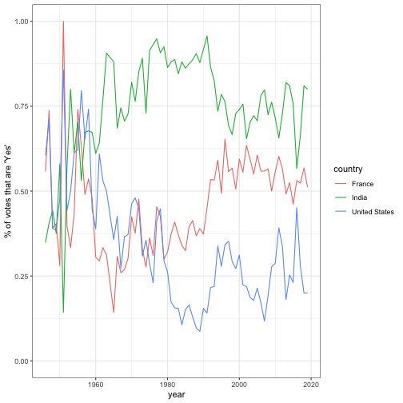
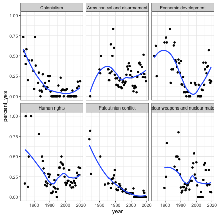

<!-- README.md is generated from README.Rmd. Please edit that file -->


## United Nations General Assembly Voting Data

[](https://cran.r-project.org/package=unvotes)
[](https://travis-ci.org/dgrtwo/unvotes)

This package provides the voting history of countries in the [United Nations General Assembly](http://www.un.org/en/ga/), along with information such as date, description, and topics for each vote.

These come from the dataset [found here](https://dataverse.harvard.edu/dataset.xhtml?persistentId=hdl:1902.1/12379):

> Erik Voeten "Data and Analyses of Voting in the UN General Assembly" Routledge Handbook of International Organization, edited by Bob Reinalda (published May 27, 2013)

This raw data, and the processing script, can be found in the [data-raw](https://github.com/dgrtwo/unvotes/tree/master/data-raw) folder.

### Installation

Install the package with:


```r
install.packages("unvotes")
```

You can also install the development version of the package using [devtools](https://github.com/r-lib/devtools):


```r
devtools::install_github("dgrtwo/unvotes")
```

### Datasets

The package contains three datasets. First is the history of each country's vote. These are represented in the `un_votes` dataset, with one row for each country/vote pair:


```r
library(dplyr)
library(unvotes)

un_votes
#> # A tibble: 869,937 x 4
#>     rcid country            country_code vote 
#>    <dbl> <chr>              <chr>        <fct>
#>  1     3 United States      US           yes  
#>  2     3 Canada             CA           no   
#>  3     3 Cuba               CU           yes  
#>  4     3 Haiti              HT           yes  
#>  5     3 Dominican Republic DO           yes  
#>  6     3 Mexico             MX           yes  
#>  7     3 Guatemala          GT           yes  
#>  8     3 Honduras           HN           yes  
#>  9     3 El Salvador        SV           yes  
#> 10     3 Nicaragua          NI           yes  
#> # … with 869,927 more rows
```

The package also contains a dataset of information about each roll call vote, including the date, description, and relevant resolution that was voted on:


```r
un_roll_calls
#> # A tibble: 6,202 x 9
#>     rcid session importantvote date       unres  amend  para short             descr                                                  
#>    <int>   <dbl>         <int> <date>     <chr>  <int> <int> <chr>             <chr>                                                  
#>  1     3       1             0 1946-01-01 R/1/66     1     0 AMENDMENTS, RULE… "TO ADOPT A CUBAN AMENDMENT TO THE UK PROPOSAL REFERRI…
#>  2     4       1             0 1946-01-02 R/1/79     0     0 SECURITY COUNCIL… "TO ADOPT A USSR PROPOSAL ADJOURNING DEBATE ON AND POS…
#>  3     5       1             0 1946-01-04 R/1/98     0     0 VOTING PROCEDURE  "TO ADOPT THE KOREAN PROPOSAL THAT INVALID BALLOTS BE …
#>  4     6       1             0 1946-01-04 R/1/1…     0     0 DECLARATION OF H… "TO ADOPT A CUBAN PROPOSAL (A/3-C) THAT AN ITEM ON A D…
#>  5     7       1             0 1946-01-02 R/1/2…     1     0 GENERAL ASSEMBLY… "TO ADOPT A 6TH COMMITTEE AMENDMENT (A/14) TO THE PROV…
#>  6     8       1             0 1946-01-05 R/1/2…     1     0 ECOSOC POWERS     "TO ADOPT A SECOND 6TH COMM. AMENDMENT (A/14) TO THE P…
#>  7     9       1             0 1946-02-05 R/1/3…     0     0 POST-WAR RECONST… "TO OPEN THE DISCUSSION ON THE POLISH DRAFT RESOLUTION…
#>  8    10       1             0 1946-02-05 R/1/3…     1     1 U.N. MEMBERS, RE… "TO ADOPT GENERAL COMM. DRAFT RESOLUTION (A/40) AS AME…
#>  9    11       1             0 1946-02-05 R/1/3…     0     0 TRUSTEESHIP AMEN… "TO ADOPT DRAFT RESOLUTIONS I AND II AS A WHOLE, OF TH…
#> 10    12       1             0 1946-02-06 R/1/3…     1     1 COUNCIL MEMBER T… "TO ADOPT PARAGRAPH (A) OF THE 6TH COMM. DRAFT RESOLUT…
#> # … with 6,192 more rows
```

Finally, the `un_roll_call_issues` dataset shows relationships between each vote and 6 issues:


```r
un_roll_call_issues
#> # A tibble: 5,745 x 3
#>     rcid short_name issue               
#>    <int> <chr>      <fct>               
#>  1    77 me         Palestinian conflict
#>  2  9001 me         Palestinian conflict
#>  3  9002 me         Palestinian conflict
#>  4  9003 me         Palestinian conflict
#>  5  9004 me         Palestinian conflict
#>  6  9005 me         Palestinian conflict
#>  7  9006 me         Palestinian conflict
#>  8   128 me         Palestinian conflict
#>  9   129 me         Palestinian conflict
#> 10   130 me         Palestinian conflict
#> # … with 5,735 more rows

count(un_roll_call_issues, issue, sort = TRUE)
#> # A tibble: 6 x 2
#>   issue                                    n
#>   <fct>                                <int>
#> 1 Arms control and disarmament          1092
#> 2 Palestinian conflict                  1061
#> 3 Human rights                          1015
#> 4 Colonialism                            957
#> 5 Nuclear weapons and nuclear material   855
#> 6 Economic development                   765
```

(Use `help()` to get information and documentation about each dataset).

### Example analysis

Many useful analyses will first involve joining the vote and roll call datasets by the shared `rcid` (roll call ID) column:


```r
library(dplyr)

joined <- un_votes %>%
  inner_join(un_roll_calls, by = "rcid")

joined
#> # A tibble: 869,937 x 12
#>     rcid country    country_code vote  session importantvote date       unres  amend  para short      descr                           
#>    <dbl> <chr>      <chr>        <fct>   <dbl>         <int> <date>     <chr>  <int> <int> <chr>      <chr>                           
#>  1     3 United St… US           yes         1             0 1946-01-01 R/1/66     1     0 AMENDMENT… TO ADOPT A CUBAN AMENDMENT TO T…
#>  2     3 Canada     CA           no          1             0 1946-01-01 R/1/66     1     0 AMENDMENT… TO ADOPT A CUBAN AMENDMENT TO T…
#>  3     3 Cuba       CU           yes         1             0 1946-01-01 R/1/66     1     0 AMENDMENT… TO ADOPT A CUBAN AMENDMENT TO T…
#>  4     3 Haiti      HT           yes         1             0 1946-01-01 R/1/66     1     0 AMENDMENT… TO ADOPT A CUBAN AMENDMENT TO T…
#>  5     3 Dominican… DO           yes         1             0 1946-01-01 R/1/66     1     0 AMENDMENT… TO ADOPT A CUBAN AMENDMENT TO T…
#>  6     3 Mexico     MX           yes         1             0 1946-01-01 R/1/66     1     0 AMENDMENT… TO ADOPT A CUBAN AMENDMENT TO T…
#>  7     3 Guatemala  GT           yes         1             0 1946-01-01 R/1/66     1     0 AMENDMENT… TO ADOPT A CUBAN AMENDMENT TO T…
#>  8     3 Honduras   HN           yes         1             0 1946-01-01 R/1/66     1     0 AMENDMENT… TO ADOPT A CUBAN AMENDMENT TO T…
#>  9     3 El Salvad… SV           yes         1             0 1946-01-01 R/1/66     1     0 AMENDMENT… TO ADOPT A CUBAN AMENDMENT TO T…
#> 10     3 Nicaragua  NI           yes         1             0 1946-01-01 R/1/66     1     0 AMENDMENT… TO ADOPT A CUBAN AMENDMENT TO T…
#> # … with 869,927 more rows
```

One could then count how often each country votes "yes" on a resolution in each year:


```r
library(lubridate)

by_country_year <- joined %>%
  group_by(year = year(date), country) %>%
  summarize(votes = n(),
            percent_yes = mean(vote == "yes"))

by_country_year
#> # A tibble: 10,461 x 4
#> # Groups:   year [73]
#>     year country     votes percent_yes
#>    <dbl> <chr>       <int>       <dbl>
#>  1  1946 Afghanistan    17       0.412
#>  2  1946 Argentina      43       0.698
#>  3  1946 Australia      43       0.558
#>  4  1946 Belarus        43       0.442
#>  5  1946 Belgium        43       0.605
#>  6  1946 Bolivia        43       0.698
#>  7  1946 Brazil         43       0.605
#>  8  1946 Canada         42       0.643
#>  9  1946 Chile          43       0.605
#> 10  1946 Colombia       42       0.310
#> # … with 10,451 more rows
```

After which this can be visualized for one or more countries:


```r
library(ggplot2)
theme_set(theme_bw())

countries <- c("United States", "India", "France")

by_country_year %>%
  filter(country %in% countries) %>%
  ggplot(aes(year, percent_yes, color = country)) +
  geom_line() +
  ylab("% of votes that are 'Yes'") +
  expand_limits(y = 0)
```



Similarly, we could look at how the voting record of the United States has changed on each of the issues by joining with the `un_roll_call_issues` dataset:


```r
joined %>%
  filter(country == "United States") %>%
  inner_join(un_roll_call_issues, by = "rcid") %>%
  group_by(year = year(date), issue) %>%
  summarize(votes = n(),
            percent_yes = mean(vote == "yes")) %>%
  filter(votes > 5) %>%
  ggplot(aes(year, percent_yes)) +
  geom_point() +
  geom_smooth(se = FALSE) +
  facet_wrap(~ issue)
```



### Code of Conduct

Please note that this project is released with a [Contributor Code of Conduct](https://github.com/dgrtwo/unvotes/blob/master/CONDUCT.md). By participating in this project you agree to abide by its terms.
